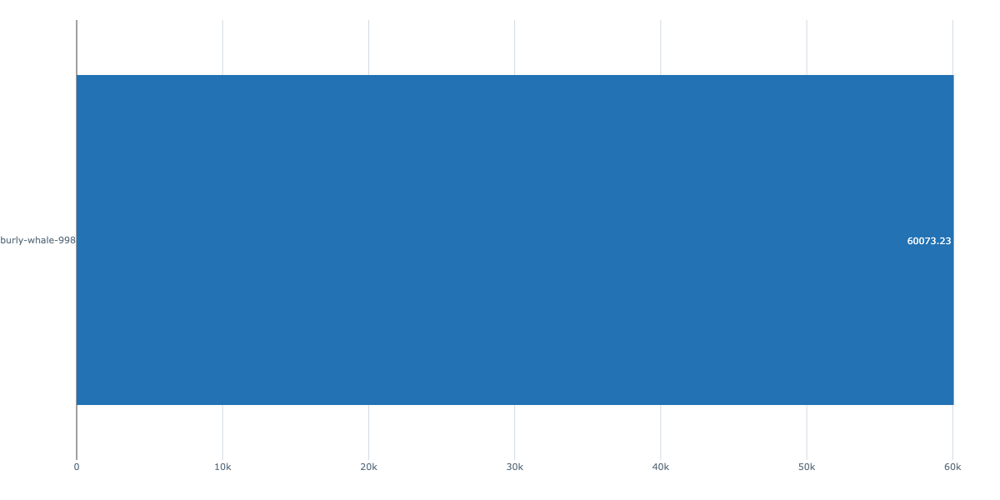
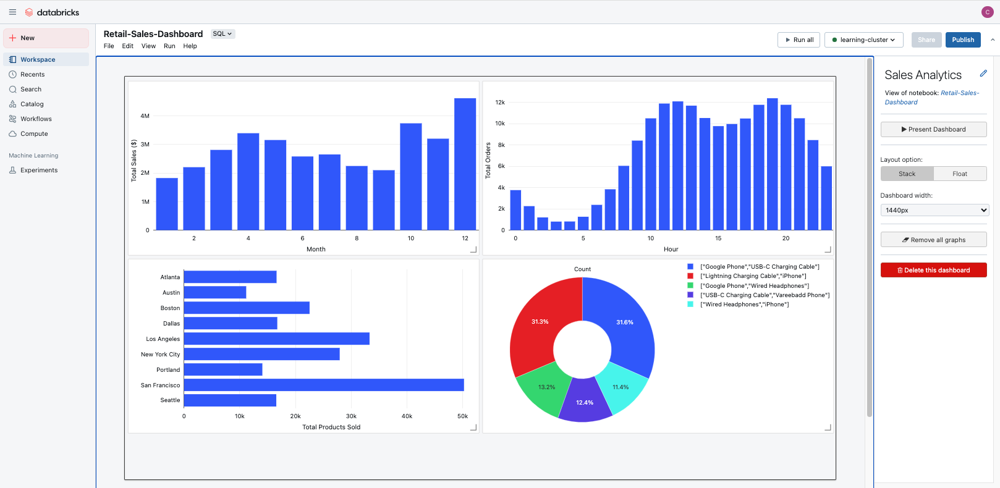

# Performance Visualizations & Dashboard  
This section showcases model evaluation visualizations and a dashboard built within the Databricks UI. These tools enhance the interpretability and communication of predictive insights derived from the retail sales dataset. 

## MLflow Evaluation Metrics  
Using MLflow, the following regression metrics were tracked for each model run:
- **Mean Absolute Error** (MAE): Measures the average magnitude of errors in predictions.
- **Root Mean Square Error** (RMSE): Penalizes larger errors more than MAE.
- **R2 Score**: Indicates how well the model explains the variance in the target variable.

All experiments and visualizations are available to view in the MLflow UI directly within Databricks. 

### Mean Absolute Error  

### Root Mean Square Error  

### R2 Score  

Each visualization reflects performance trends across training runs, allowing transparent analysis of model behavior. 

## Databricks Dashboard  
A custom dashboard was built in the Databricks SQL UI. The dashboard includes:
- **Monthly Revenue Trends**
- **Peak Ordering Times**
- **Geographic Breakdown of Orders**
- **Popular Product Combinations**  

These charts were sourced from queries written in:
- **Retail-Sales-Queries.sql**
- **Retail-Sales-Analytics.sql**

The dashboard allows dynamic filtering by month, product, or location, and was used to communicate final insights to the stakeholders.  

